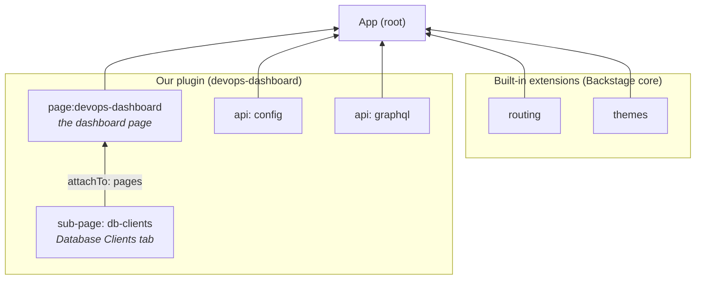
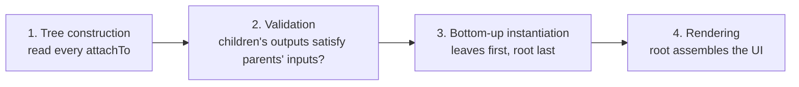

# Backstage in five minutes

[Backstage](https://backstage.io) = framework for internal developer portals: one web app, all team tools, single UI. You write **plugins**; the framework composes them into the app.

As a mental-model shortcut, each Backstage concept maps to an Angular one:

| Angular                                   | Backstage                                                                                                                          | In our code                                                                                                                             |
| ----------------------------------------- | ---------------------------------------------------------------------------------------------------------------------------------- | --------------------------------------------------------------------------------------------------------------------------------------- |
| `main.ts` bootstrapping `AppModule`       | App (root orchestrator)                                                                                                            | `packages/app/src/App.tsx`                                                                                                              |
| `NgModule`                                | Plugin                                                                                                                             | `createFrontendPlugin({ pluginId: 'devops-dashboard' })`                                                                                |
| `NgModule` imports                        | `attachTo` (declared in the imported extension, not in the parent importer)                                                        | `attachTo:{ id: 'page:devops-dashboard', input: 'pages' }` // the child extension declares where it attaches (parent id + parent input) |
| Component                                 | Extension                                                                                                                          | `devopsDashboardHomePage`, `dbClientsSubPage`                                                                                           |
| Service                                   | Utility API extension                                                                                                              | `configApi`, `graphQLApi` // injected with `useApi` util                                                                                |
| Decorators (`@NgModule`, `@Component`...) | Utils: `createFrontendPlugin`, blueprints (`PageBlueprint`, `SubPageBlueprint`, `ApiBlueprint`)                                    | `PageBlueprint.make({ ... })`                                                                                                           |
| `Routes` array / `provideRouter`          | Routes are registered on bootstrap by collecting every page extension's routes (`params.path`, `params.routeRef`, `params.loader`) | `homePage` `params.path: '/devops-dashboard'` + `rootRouteRef` (for linking)                                                            |

## 1. The App — the composer

The **App** = root orchestrator, like `main.ts` bootstrapping `AppModule`. No business logic: it reads config and composes everything into one **Extension Tree**. Ours lives in `packages/app`.

## 2. Extensions — the building blocks

An **extension** = one node in the Extension Tree: a page, a tab, an API client, a nav item. Think Angular components and services. Two flavors:

- **Built-in extensions** — Backstage core: routing, error boundaries, theme registry.
- **Plugin extensions** — from plugins like ours. A plugin exposes everything _exclusively_ as extensions: pages, nav elements, APIs, features for other plugins.

### Plugin — the extension container

A **plugin** = the module/package with a feature's extensions — the unit you publish and version. It bundles **extensions** (the components and APIs it provides) and **routes** (the routeRefs other code links to by name). Ours:

```ts
export const devopsDashboardPlugin = createFrontendPlugin({
  pluginId: 'devops-dashboard',
  extensions: [homePage, dbClientsSubPage, configApi, graphQLApi],
  routes: { root: rootRouteRef, dbClients: dbClientsRouteRef },
});
```

Rule of thumb: **you publish plugins, you wire extensions.**

### Plugin installation

Nobody imports our plugin into the app — it is **discovered**. Installing = adding a dependency; the chain runs through configuration:

1. The consumer installs the package: `yarn add @internal/backstage-plugin-devops-dashboard` (run in `packages/app`; resolves as a workspace dependency in our monorepo).
2. [`packages/app/package.json`](../packages/app/package.json) now depends on the plugin: `"@internal/backstage-plugin-devops-dashboard": "workspace:^"`.
3. [`app-config.yaml`](../app-config.yaml) says `app: packages: all` — "scan my dependencies for Backstage packages".
4. The scanner detects the dependency plugins and wires them into the Extension Tree.

## 3. The Extension Tree

On bootstrap, the framework arranges every extension into a strict parent-child tree and instantiates it bottom-up: children before parents. Every extension has a single parent and a single communication — on bootstrap, with that parent only. Outputs carry structure, not live data.



Arrows = data flow: children hand outputs up to their parent.

### Extension placement and communication

**1. The parent declares its typed inputs** — named slots listing the exact data types a child must supply. The parent sees only the types it lists; extras are ignored:

```ts
// From PageBlueprint's own source (the blueprint our page is built with):
// it declares a named input 'pages' — the slot where sub-pages may attach.
const PageBlueprint = createExtensionBlueprint({
  kind: 'page',
  inputs: {
    pages: createExtensionInput([
      coreExtensionData.routePath,
      coreExtensionData.reactElement,
      coreExtensionData.routeRef.optional(),
      coreExtensionData.title.optional(),
      coreExtensionData.icon.optional(),
    ]),
  },
  // ...output, configSchema, factory
});
```

**2. The child declares the parent's input it targets and provides the data** (`attachTo`) — its params become the output, emitted as typed extension data references (`coreExtensionData.routePath`, `coreExtensionData.reactElement`, …):

```ts
export const dbClientsSubPage = SubPageBlueprint.make({
  attachTo: { id: 'page:devops-dashboard', input: 'pages' },
  name: 'db-clients',
  params: {
    path: 'db-clients',
    title: 'Database Clients',
    icon: <StorageIcon />,
    routeRef: dbClientsRouteRef,
    loader: () =>
      import('./components/DbClientsSection').then(m => <m.DbClientsSection />),
  },
});
```

The child's output (`params`) IS the parent's input.

**3. The address (`attachTo.id`) is a computed string**: `<kind>:<namespace>[/<name>]` — namespace defaults to the plugin ID; unnamed extensions drop `/<name>`. Our page declares no `name` → it answers to `page:devops-dashboard`. The contract is verified at startup: mismatch → fail fast.

## 4. Utils — the glue

Utils = the framework's factory functions — Backstage's answer to Angular decorators. For example, `createFrontendPlugin` bundles extensions under one plugin ID (`@NgModule`), and Blueprints (`PageBlueprint`, `SubPageBlueprint`, `ApiBlueprint`, …) create common extension kinds without boilerplate. They carry the typing that handles the input/output setup.

## 5. Core mechanics

### Configuration (`configSchema` + app-config)

Each extension declares its accepted config via a schema (Zod), defaults included. Integrators tune it in `app-config.yaml`. Provided config replaces, never merges.

The contract — the plugin declares its config shape in [`config.d.ts`](../plugins/devops-dashboard/config.d.ts) (`@visibility frontend` makes a key readable in the browser):

```ts
export interface Config {
  devopsDashboard?: {
    /** @visibility frontend */
    profiles?: Array<{
      /** @visibility frontend */
      id: string;
      /** @visibility frontend */
      dbClientsGraphqlUrl?: string;
    }>;
  };
}
```

The provision — the integrator fills the contract in [`app-config.yaml`](../app-config.yaml):

```yaml
devopsDashboard:
  profiles:
    - id: oauth-dev
      dbClientsGraphqlUrl: https://localhost:9443/oauth-dev/clients-graphql-api
```

### Routing — `path`, `routeRef`, and the plugin's router API

Pages don't register routes — they _output_ a path, a route ref, and a React element. The app's route registry assembles the router config from them on bootstrap. Our plugin shows the whole mechanism in three declarations.

**1. Declare the names** ([`routes.ts`](../plugins/devops-dashboard/src/routes.ts)). A route ref = an empty token: pure identity, no URL.

```ts
export const rootRouteRef = createRouteRef();
export const dbClientsRouteRef = createRouteRef();
```

**2. Bind each name to a destination** (the page extensions). Each page declares its URL and hands its ref to it.

```ts
export const homePage = PageBlueprint.make({
  // An absolute path declares a top-level Routes entry
  params: { path: '/devops-dashboard', routeRef: rootRouteRef /* ... */ },
});

export const dbClientsSubPage = SubPageBlueprint.make({
  // A relative path declares a children route Routes entry
  // The router composes /devops-dashboard/db-clients and binds each ref
  // to its final URL.
  attachTo: { id: 'page:devops-dashboard', input: 'pages' },
  params: { path: 'db-clients', routeRef: dbClientsRouteRef /* ... */ },
});
```

`path` lives in the config schema → an integrator can remap any URL in `app-config.yaml`, and no link breaks: code navigates refs, never URL strings.

**3. Export the router API** (the plugin). The `routes` map publishes the refs under stable names. The keys become the public route names (`devops-dashboard.root`, `devops-dashboard.dbClients`) other parts of the app can link to.

```ts
export const devopsDashboardPlugin = createFrontendPlugin({
  pluginId: 'devops-dashboard',
  extensions: [homePage, dbClientsSubPage, configApi, graphQLApi],
  routes: { root: rootRouteRef, dbClients: dbClientsRouteRef },
});
```

**Third-party consumption.** A consumer never imports our package. It declares an **external route ref** — a link placeholder — with our public route name as its default target:

```ts
// a hypothetical "reports" plugin
export const dbClientsExternalRef = createExternalRouteRef({
  defaultTarget: 'devops-dashboard.dbClients',
});

export const reportsPlugin = createFrontendPlugin({
  pluginId: 'reports',
  extensions: [reportsPage],
  externalRoutes: { dbClients: dbClientsExternalRef },
});
```

```tsx
const dbClientsLink = useRouteRef(dbClientsExternalRef);
if (!dbClientsLink) return null; // dashboard not installed — hide the link
return <Link to={dbClientsLink()}>Inspect database clients</Link>;
```

Resolution order: explicit binding in `app-config.yaml` (`app.routes.bindings`) → `defaultTarget` → `undefined`. Never a startup error. Producer exports `routes`, consumer exports `externalRoutes`, the app connects placeholder to destination by name.

## The role of React

Backstage is a React app: the framework decides _what exists and where_ (the Extension Tree, frozen on bootstrap); React renders it. The deviations from a standard React app concentrate in state management.

- **App level — owned by the app.** A plugin cannot wrap the whole app in a context provider (`AppRootElementBlueprint` mounts global _elements_ — overlays, alerts — not wrappers). App-wide context providers belong to `packages/app`, typically as a frontend module registered in `createApp({ features: [...] })` — like our `authModule` (Curity sign-in) in [`App.tsx`](../packages/app/src/App.tsx).
  - **App-level state — utility APIs.** The exception to the context restriction: a plugin ships an API extension, and `useApi` hands any component the same shared instance regardless of tree position — app-level sharing (state and functionality) without context providers, like Angular's `providedIn: 'root'`:

    ```tsx
    // any component, any extension — same instance everywhere
    const configApi = useApi(devopsDashboardConfigApiRef);
    const profiles = await configApi.getProfiles();
    ```

- **Plugin level — `PluginWrapperBlueprint`.** A regular React context provider around all the plugin's extensions; its `useWrapperValue` hook runs in a single place, so the value is genuinely shared:

```tsx
export const devopsDashboardWrapper = PluginWrapperBlueprint.make({
  params: define =>
    define({
      loader: async () => ({
        useWrapperValue: () => useApi(devopsDashboardGraphQLApiRef).getClient(),
        component: ({ children, value }) => (
          <ApolloProvider client={value}>{children}</ApolloProvider>
        ),
      }),
    }),
});
```

- **Page level — not authorable by default.** Sub-pages render inside the page's element, so they receive whatever context exists above them: app, plugin-wrapper, and the framework's own page-level context (e.g. breadcrumbs). What you cannot do is add _your own_ context provider at the page level: a page's component loader is mutually exclusive with sub-page default rendering (true page-level wrapping would require forking `PageBlueprint` with `makeWithOverrides`).
- **Extension level and below — default React.** Any extension can wrap its own element with a context provider, and inside components everything is plain React: state, hooks, effects, context, `useApi`.

## Rendering notes

- **Everything mounts lazily, semi-isolated.** Each extension's component loads via `React.lazy()` on first visit and renders inside its own `ExtensionBoundary` (error boundary + suspense): one broken extension doesn't crash the app, and module-level code runs on first render, not at app start.
- **Sub-page tabs are routes, not stateful tabs.** Switching tabs is a navigation: React Router unmounts the previous sub-page and its local state — standard Router behavior; the deviation is that tabs _are_ routes. State that must survive a tab switch belongs in a utility API.

Official guide: [Building frontend plugins](https://backstage.io/docs/frontend-system/building-plugins/index) — pages, `React.lazy()` loaders, and components.

## 6. From code to running app



1. **Tree construction** — read all extensions + their `attachTo`. Integrators can override `attachTo` in `app-config.yaml`: move extensions without touching code.
2. **Validation** — every child output must satisfy its parent input. Mismatch → fail fast at startup.
3. **Bottom-up instantiation** — the step to remember. Child factory runs first: gets its config + its own children's inputs, yields outputs. Outputs flow up through the attachment point → become an input entry on the parent → parent factory runs → passes its output further up.
4. **Rendering** — root extensions (app core, routes, page layouts) assemble the collected React elements and route refs into the UI.

## Cheat sheet

| Backstage term         | Meaning                                                                                          | Angular reflex              |
| ---------------------- | ------------------------------------------------------------------------------------------------ | --------------------------- |
| `createFrontendPlugin` | Bundles a plugin's extensions under one `pluginId`                                               | `@NgModule`                 |
| Blueprints             | Helpers that create common extension kinds without boilerplate                                   | `@Component`, `@Injectable` |
| Extension ID           | `<kind>:<namespace>[/<name>]`, e.g. `page:devops-dashboard`                                      | selector, but computed      |
| `attachTo`             | `{ id, input }` — where this extension plugs in, declared by the child                           | `imports` array, inverted   |
| Output                 | Typed data a child yields to its parent (element, route ref, API factory)                        |                             |
| Input                  | A named slot a parent exposes; it only sees the data types it declared                           |                             |
| `routeRef`             | A stable, linkable name for a destination — code navigates through it, never through URL strings | route constant              |
| `externalRoutes`       | A `routeRef` placeholder to another plugin's destination; the app binds it by name               |                             |
| Utility API extension  | A typed client other extensions consume                                                          | service / provider          |
| `app-config.yaml`      | Where integrators configure and re-arrange extensions                                            | `environment.ts`, DI config |

## Where to go deeper

- [Backstage frontend system: architecture](https://backstage.io/docs/frontend-system/architecture/index)
- [Extensions](https://backstage.io/docs/frontend-system/architecture/extensions)
- [Extension blueprints](https://backstage.io/docs/frontend-system/architecture/extension-blueprints)
- Our plugin's entry point: [`plugins/devops-dashboard/src/plugin.tsx`](../plugins/devops-dashboard/src/plugin.tsx)
